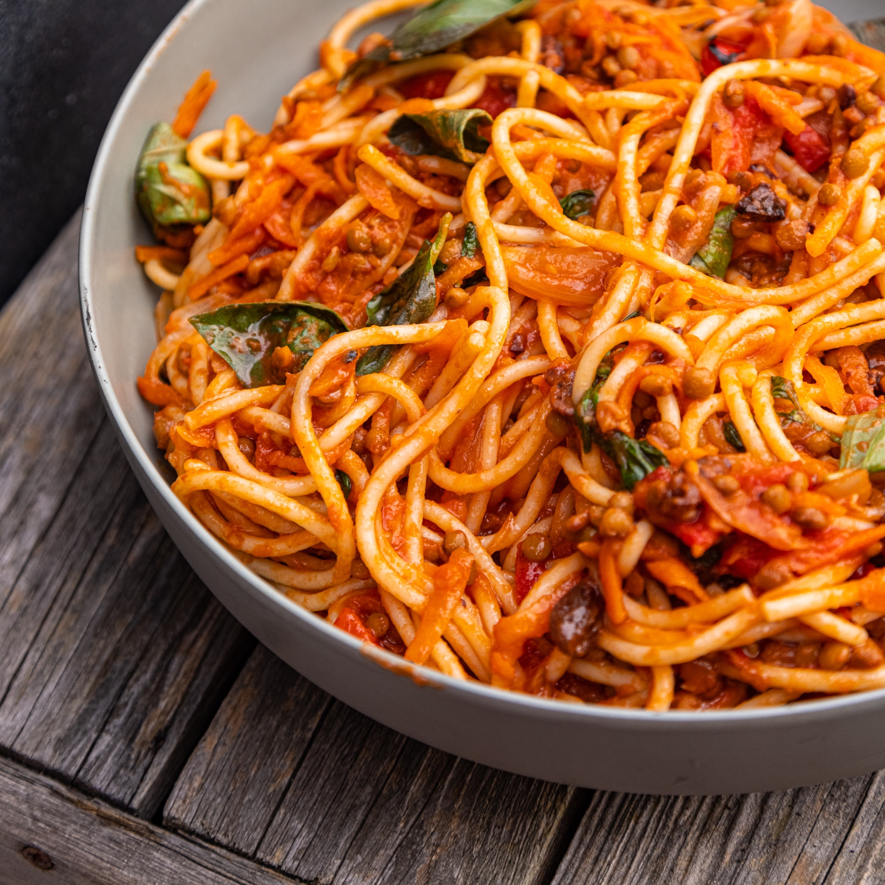

# QUICK CAPONATA SPAGHETTI BOLOGNESE

 Caponata is a yummy Sicilian dish made with mediterranean veg, basil, tomatoes and olives, we wanted to challenge ourselves to make a super quick 5 minute making a caponata influenced version of classic spaghetti bolognese that everyone will love!

 
 
INGREDIENTS

- 200 g spaghetti dry
- 1 medium onion
- 200 g roasted red peppers in jar
- 1 tsp garlic powder or 1 large clove garlic
- 1 large carrot – grated
- 1 jar of tomato passata or chopped tomatoes 500g
- 1 x tin of cooked Lentils 400g
- Small bunch Basil
- 40 g pitted Olives
- 25 g of raisins or sultanas
